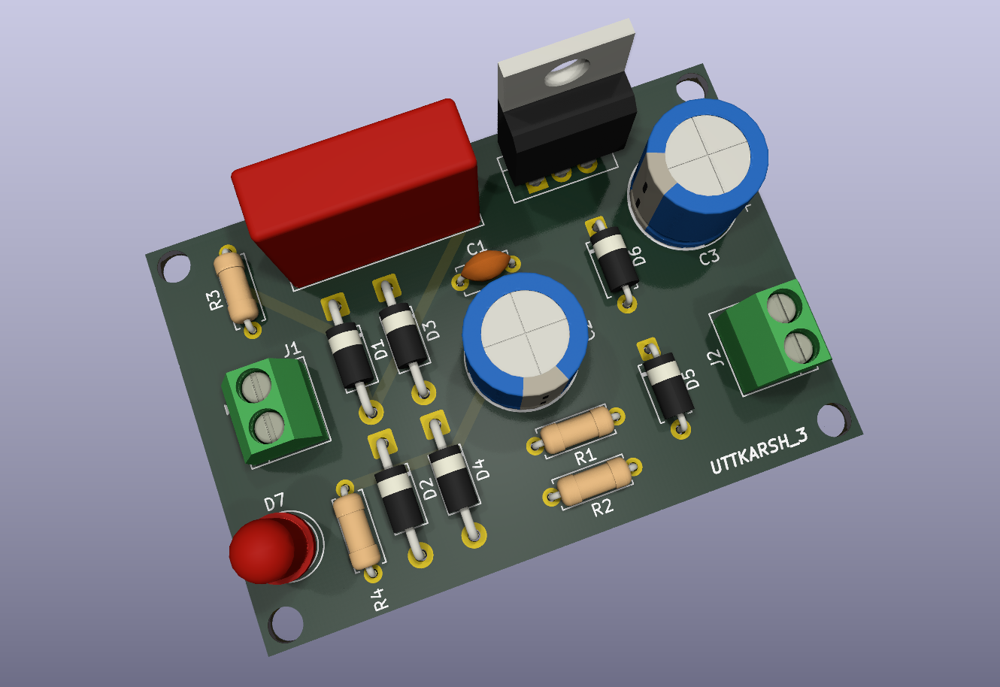
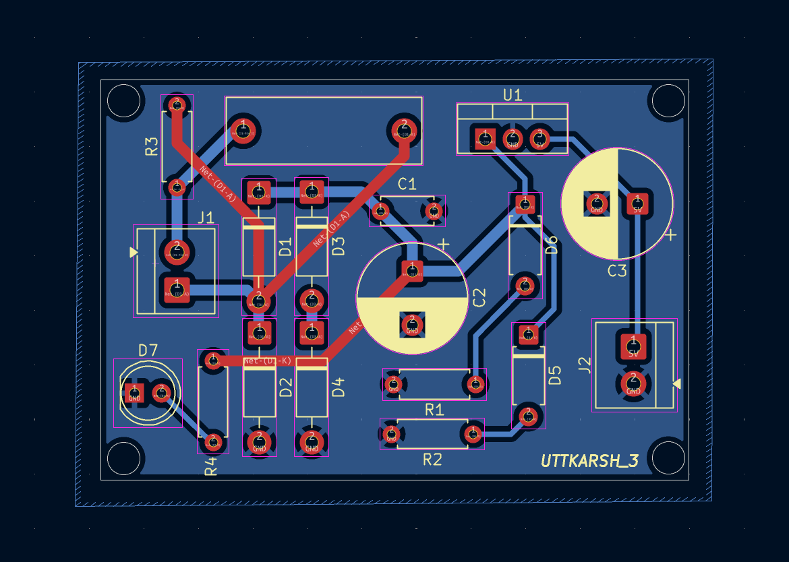
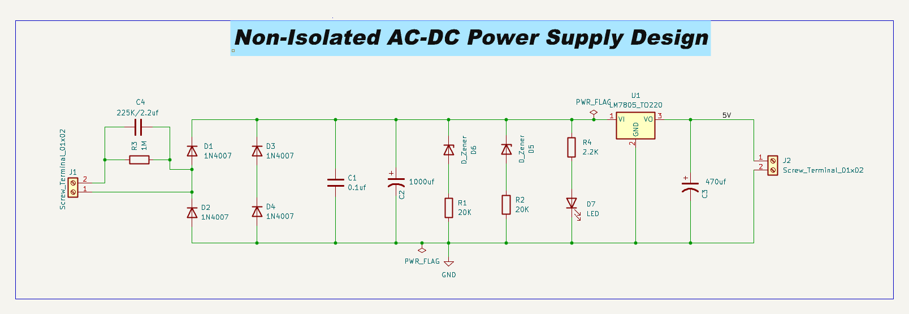

# ⚡ Non-Isolated AC-DC Power Supply (230V AC to 5V DC)

---

## ⚙️ What I Built

A **capacitive dropper-based AC-DC power supply** designed to step down **230V AC** and provide a regulated low-voltage DC output (**~5V, low current**).

---

## 🚀 Overview

This design eliminates bulky transformers by using a **reactive impedance (capacitor)** to efficiently drop voltage.

It includes:

* Capacitive voltage dropper
* Full-wave bridge rectifier
* Filtering stage
* Zener-based regulation
* Linear voltage regulator for stable 5V output

---

## 📷 Project Preview

---

## 🧠 Design Architecture (Key Stages)

🔌 **Input Stage**

* 230V AC input via screw terminal
* Capacitor (C4) acts as voltage dropper
* Resistor (R3) for inrush current limiting

🔄 **Rectification**

* Bridge rectifier using **4× 1N4007 diodes**

🔋 **Filtering**

* Bulk capacitor (**1000µF**) smooths DC
* Small capacitor (**0.1µF**) for noise suppression

⚖️ **Regulation**

* Zener diodes stabilize intermediate voltage
* **7805 linear regulator** provides steady 5V output

🔌 **Output Stage**

* 470µF capacitor for ripple reduction
* LED indicator for power status

---

## 📌 Key Takeaways

✔ Compact and cost-effective design
✔ Eliminates bulky transformers

❌ Non-isolated → serious safety limitations

⚠️ Suitable only for **low-power, controlled environments** due to direct mains interaction

---

## 🧩 PCB Design Insights

* Maintained separation between high-voltage and low-voltage sections
* Optimized component placement for shorter trace paths
* Considered spacing constraints for safer operation
* Used 3D visualization to validate layout decisions

---

## ⚠️ Safety Note

This is a **non-isolated power supply**:

* Output is directly referenced to mains
* Risk of electric shock is high
* Not suitable for open-use or human interaction

👉 Use only in **enclosed, insulated systems**

---

## 🧪 Applications

* Low-power embedded systems
* IoT nodes
* Indicator / control circuits

---

## ⚠️ Limitations

- No electrical isolation from mains  
- Limited current capability  
- Poor regulation under varying load  
- Not suitable for high-power applications  

---

## 🚀 Future Improvements

- Replace with isolated SMPS design  
- Add fuse and MOV for protection  
- Improve thermal handling  
- Compact SMD version  

---

## 🛠 Tools Used

* KiCad (Schematic + PCB Design + 3D visualization)

